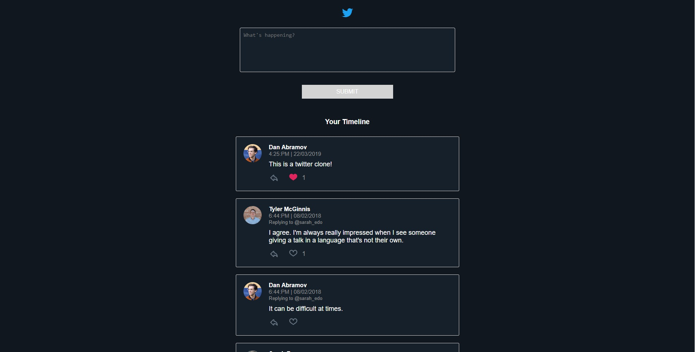

# Chirper Project

This repo is a code-along with the first project in the [React Nanodegree program](https://www.udacity.com/course/react-nanodegree--nd019).

Most of the commits in this repository correspond to videos in the program.

## Project Setup

* clone the Project - `git@github.com:udacity/reactnd-chirper-app.git`
* install the dependencies - `npm install`

## About

This project has been modified by [me](https://github.com/vinicius98s) and this is what looks like:

## License

MIT
